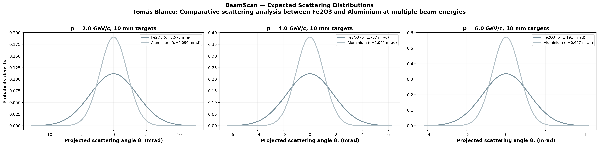
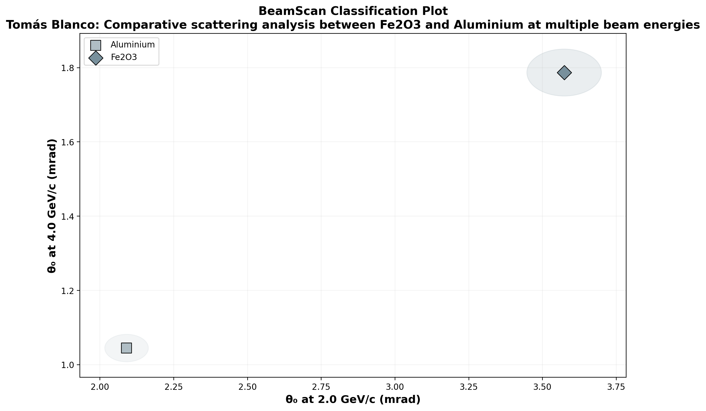

# 🔬 BeamScan Simulation Results

**Author:** Tomás Blanco  
**Description:** Comparative scattering analysis between Fe2O3 and Aluminium at multiple beam energies  
**Generated:** 2026-03-02 14:37 UTC  
**Method:** Highland formula (analytical)

## Beam Settings
- Particle: `e-`
- Momenta: [2.0, 4.0, 6.0] GeV/c
- Events requested: 10,000

## Predictions

| Material | p (GeV/c) | θ₀ (mrad) | ΔE (MeV) | X₀ (cm) | Thickness |
|----------|-----------|-----------|----------|---------|----------|
| Fe2O3 | 2.0 | **3.573** | 10.5 | 3.3 | 10.0 mm |
| Fe2O3 | 4.0 | **1.787** | 10.5 | 3.3 | 10.0 mm |
| Fe2O3 | 6.0 | **1.191** | 10.5 | 3.3 | 10.0 mm |
| Aluminium | 2.0 | **2.090** | 5.4 | 8.9 | 10.0 mm |
| Aluminium | 4.0 | **1.045** | 5.4 | 8.9 | 10.0 mm |
| Aluminium | 6.0 | **0.697** | 5.4 | 8.9 | 10.0 mm |

## Discrimination Power (at 2.0 GeV/c)

Events needed for 3σ separation:

| | Fe2O3 | Aluminium |
|---|---|---|
| **Fe2O3** | — | ✅ 66 |
| **Aluminium** | ✅ 66 | — |

✅ Easy (<5k events) | ⚠️ Moderate (5k–100k) | ❌ Impractical (>100k)

## Figures

---
*Generated automatically by BeamScan Highland Calculator*
