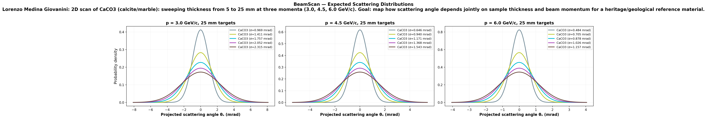
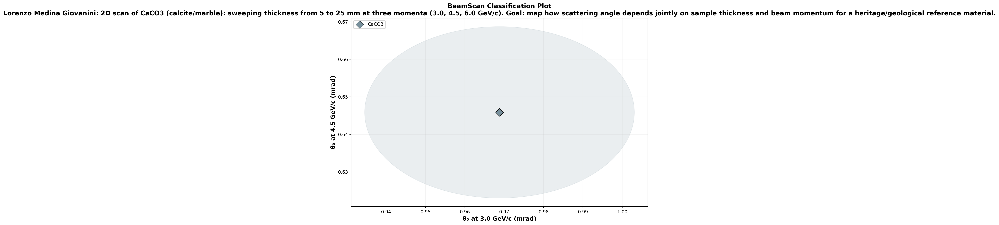

# 🔬 BeamScan Simulation Results

**Author:** Lorenzo Medina Giovanini  
**Description:** 2D scan of CaCO3 (calcite/marble): sweeping thickness from 5 to 25 mm at three momenta (3.0, 4.5, 6.0 GeV/c). Goal: map how scattering angle depends jointly on sample thickness and beam momentum for a heritage/geological reference material.  
**Generated:** 2026-03-02 14:28 UTC  
**Method:** Highland formula (analytical)

## Beam Settings
- Particle: `e-`
- Momenta: [3.0, 4.5, 6.0] GeV/c
- Events requested: 10,000

## Predictions

| Material | p (GeV/c) | θ₀ (mrad) | ΔE (MeV) | X₀ (cm) | Thickness |
|----------|-----------|-----------|----------|---------|----------|
| CaCO3 | 3.0 | **0.969** | 2.8 | 8.7 | 5.0 mm |
| CaCO3 | 4.5 | **0.646** | 2.8 | 8.7 | 5.0 mm |
| CaCO3 | 6.0 | **0.484** | 2.8 | 8.7 | 5.0 mm |
| CaCO3 | 3.0 | **1.411** | 5.6 | 8.7 | 10.0 mm |
| CaCO3 | 4.5 | **0.940** | 5.6 | 8.7 | 10.0 mm |
| CaCO3 | 6.0 | **0.705** | 5.6 | 8.7 | 10.0 mm |
| CaCO3 | 3.0 | **1.757** | 8.4 | 8.7 | 15.0 mm |
| CaCO3 | 4.5 | **1.171** | 8.4 | 8.7 | 15.0 mm |
| CaCO3 | 6.0 | **0.878** | 8.4 | 8.7 | 15.0 mm |
| CaCO3 | 3.0 | **2.052** | 11.2 | 8.7 | 20.0 mm |
| CaCO3 | 4.5 | **1.368** | 11.2 | 8.7 | 20.0 mm |
| CaCO3 | 6.0 | **1.026** | 11.2 | 8.7 | 20.0 mm |
| CaCO3 | 3.0 | **2.315** | 14.0 | 8.7 | 25.0 mm |
| CaCO3 | 4.5 | **1.543** | 14.0 | 8.7 | 25.0 mm |
| CaCO3 | 6.0 | **1.157** | 14.0 | 8.7 | 25.0 mm |

## Discrimination Power (at 3.0 GeV/c)

Events needed for 3σ separation:

| | CaCO3 | CaCO3 | CaCO3 | CaCO3 | CaCO3 |
|---|---|---|---|---|---|
| **CaCO3** | — | ✅ 131 | ✅ 54 | ✅ 35 | ✅ 27 |
| **CaCO3** | ✅ 131 | — | ✅ 378 | ✅ 132 | ✅ 77 |
| **CaCO3** | ✅ 54 | ✅ 378 | — | ✅ 748 | ✅ 240 |
| **CaCO3** | ✅ 35 | ✅ 132 | ✅ 748 | — | ✅ 1,243 |
| **CaCO3** | ✅ 27 | ✅ 77 | ✅ 240 | ✅ 1,243 | — |

✅ Easy (<5k events) | ⚠️ Moderate (5k–100k) | ❌ Impractical (>100k)

## Figures

---
*Generated automatically by BeamScan Highland Calculator*
